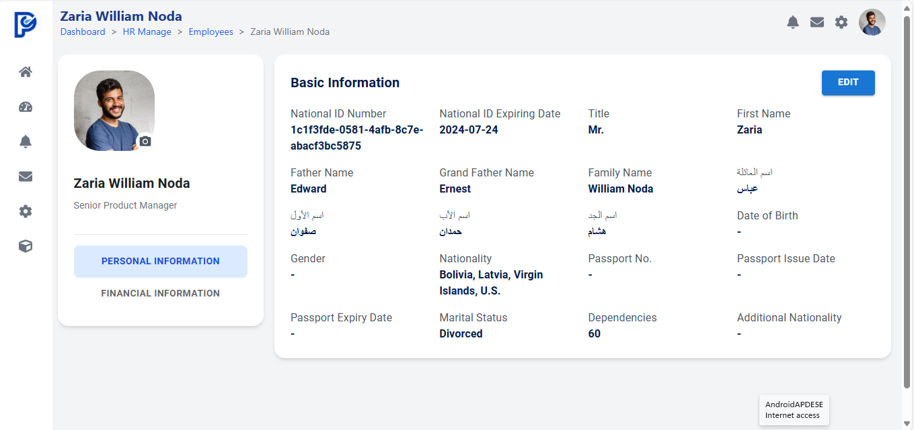
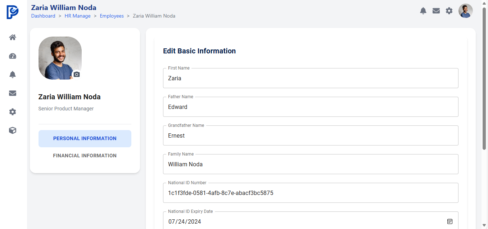

# **FS TASK**

This project is a monorepo created using **Nx**. It contains two applications:  
- **Frontend**: Built with React, TypeScript, MUI, TailwindCSS, and React Hook Form.  
- **Backend**: Built with NestJS and serves GraphQL queries and mutations with static data.  

Both applications are integrated to work together as a unified system.

---

## **Project Structure**

```
/fs-task
├── apps
│   ├── frontend   
│   └── backend    
├── libs           
├── node_modules
├── nx.json        
├── package.json   
├── tsconfig.json  
└── README.md     
```

---

## **Technologies Used**
- **Nx** (for monorepo management)
- **React** (for frontend)
- **TypeScript** (for both frontend and backend)
- **TailwindCSS** (for responsive UI)
- **MUI** (for UI components)
- **React Hook Form** (for form management)
- **NestJS** (for backend API)
- **GraphQL** (for API queries and mutations)

---

## **System Requirements**
- **Node.js** (v18+ recommended)
- **Yarn** or **npm**
- **Nx CLI** (optional, for enhanced monorepo tooling)

---

## **Installation**

To run this project locally, follow these steps.

1. **Clone the repository**:
   ```bash
   git clone https://github.com/AhmedNewiry/FS-TASK.git
   cd FS-TASK
   ```

2. **Install Nx CLI globally (if not already installed)**:
   ```bash
   npm install -g nx
   ```

   > **Note:** This step ensures that you have access to `nx` commands globally.

3. **Install project dependencies**:
   ```bash
   npm install
   # or
   yarn install
   ```

4. **Run the applications**:
   ```bash
   nx serve backend
   nx serve frontend
   ```

   - **Frontend** will be available at: [http://localhost:4200](http://localhost:4200)
   - **Backend** will be available at: [http://localhost:4000/graphql](http://localhost:4000/graphql)

---

## **Frontend Application**

### **Features**
1. **Figma Design**: The UI follows a Figma design to achieve a pixel-perfect layout.
2. **User Interface**:
   - Uses **React** and **TypeScript**.
   - Styled with **MUI** and **TailwindCSS**.
   - Displays user information fetched from the backend.
   - Implements **edit functionality** for user information with pre-populated fields.
   - Sends updated user information to the backend using a GraphQL mutation.

3. **Performance**:
   - Optimized rendering using React best practices.
   - Efficient use of component re-renders and state management.

4. **Clean Design**:
   - UI strictly follows the **Figma design**.
   - Three tabs are implemented with design only (no backend integration except for the first card).

### **Running the Frontend**

Run the following command:
```bash
nx serve frontend
```

The **frontend** will be available at: [http://localhost:4200](http://localhost:4200).

### **Available Pages**
- **Basic Information** (Interactive)
- **Other Tabs** (Design only, no data)

---



## **Backend Application**

### **Features**
1. **GraphQL API**:
   - Built using **NestJS** and **GraphQL**.
   - Exposes a simple API with queries and mutations.

2. **Queries and Mutations**:
   - **Query**: Get user basic information.
   - **Mutation**: Update user information.

3. **Static Data**:
   - The backend serves static data as no database is used for this task.

### **GraphQL Endpoints**
1. **GraphQL Playground**: [http://localhost:4000/graphql](http://localhost:4000/graphql)  
   Use this URL to run GraphQL queries and mutations.

### **Example Query**
```graphql
query GetUserBasicInfo {
  user {
    id
    firstName
    lastName
    email
    nationalId {
      idNumber
      expiryDate
    }
  }
}
```

### **Example Mutation**
```graphql
mutation UpdateUser($updateUserInput: UpdateUserInput!) {
  updateUser(updateUserInput: $updateUserInput) {
    id
    firstName
    lastName
    email
  }
}
```

### **Running the Backend**

Run the following command:
```bash
nx serve backend
```

The **backend** will be available at: [http://localhost:4000/graphql](http://localhost:4000/graphql).  
You can explore and test queries/mutations in the **GraphQL Playground**.

---

## **Troubleshooting**

### **Problem: Application Won't Start**
If you encounter issues while running the project, follow these steps.

1. **Run the following command to clear Nx cache**:
   ```bash
   npx nx reset
   ```

2. **Reinstall dependencies**:
   ```bash
   rm -rf node_modules
   npm install
   ```

3. **Start the apps again**:
   ```bash
   nx serve backend
   nx serve frontend
   ```

### **Other Common Issues**
- **Port Conflict**: Make sure **port 4000** (backend) and **port 4200** (frontend) are available.
- **Missing Dependencies**: Run `npm install` or `yarn install` to ensure all dependencies are installed.
- **Environment Issues**: Ensure **Node.js v18+** is installed.

---

## **Project Goals**

1. **Performance**:
   - Optimized React rendering.
   - Reduced re-renders and efficient use of state.

2. **Pixel-Perfect Design**:
   - Strict adherence to the **Figma design**.

3. **Clean Code**:
   - Follows best practices for maintainability.

4. **Documentation**:
   - Clear instructions for setting up, running, and troubleshooting the project.

---

If you have any questions, please reach out for support. Happy coding! 🚀

